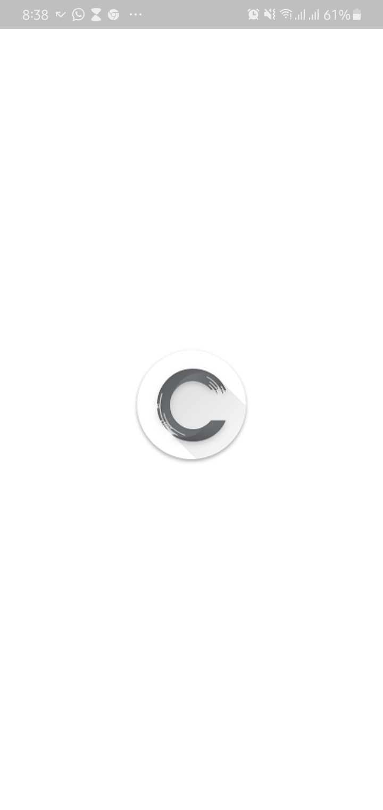
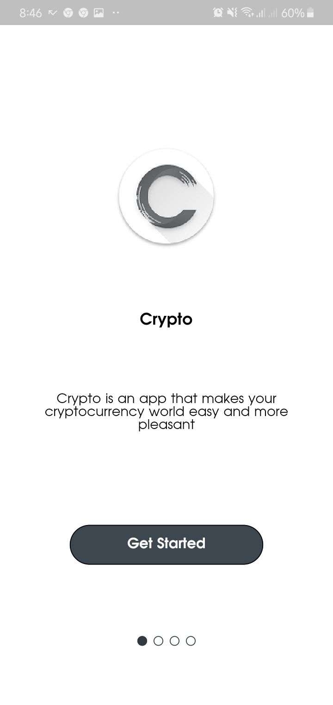
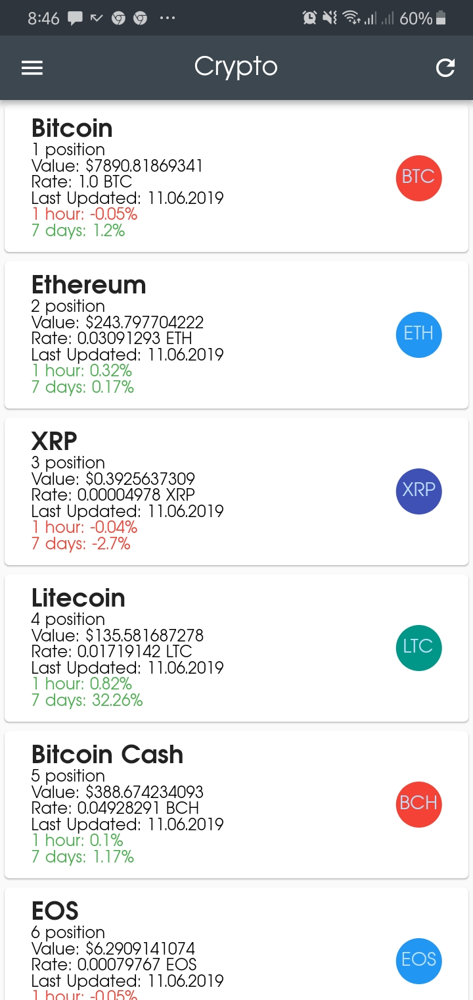
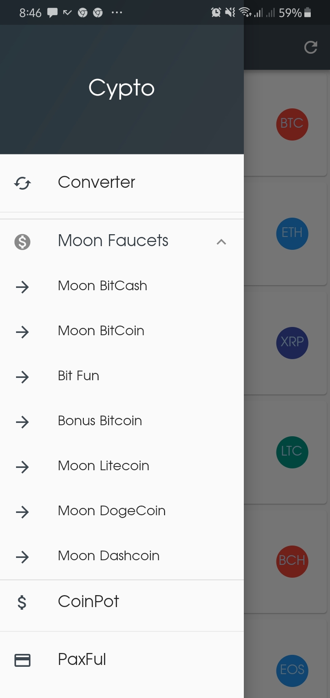
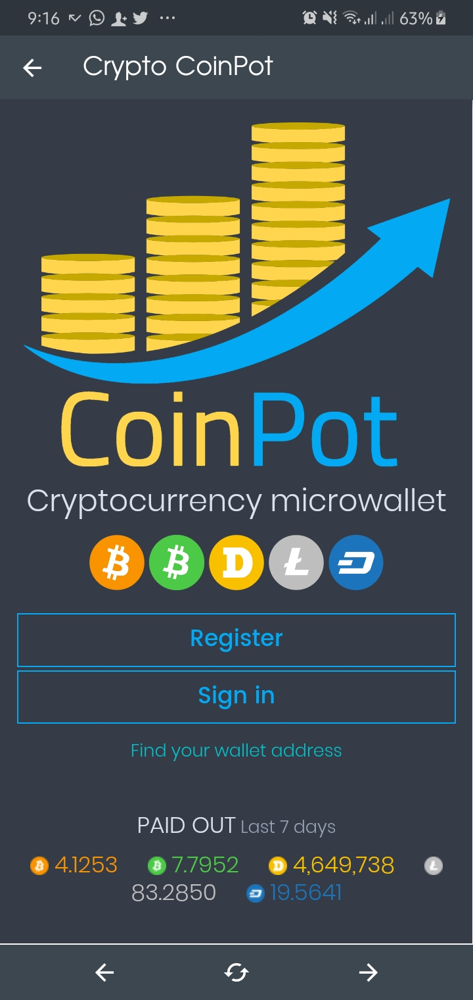
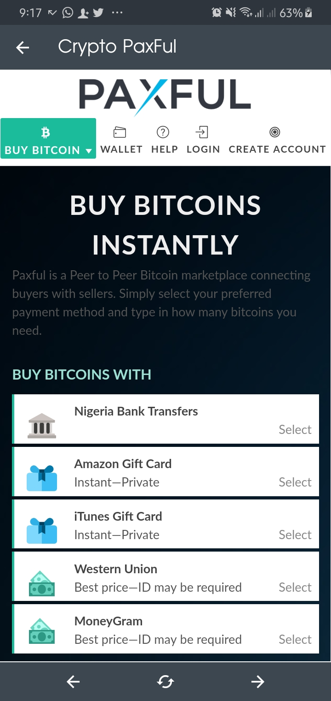

# Crypto

Crypto is an app for a group of **cryptocurrency** lovers. It allows them see recent currency updates, login to their **Coinpot** Account and manage their **Paxful** Wallet.

## Features

Here is a list of features that it has:

- Currency Update: the user can view a list of currecy with its recent details.
- CoinPot: the user can access their **Coinpot** account to make transactions within the app.
- Moon Faucet: the user can claim their free currency with their moon faucet account.
- PayFul: the user can access thier **Paxful** Account to make transactions within the app.
- Syncronizing updates: the app synchronizes coin with Coinmarketcap server for updates on currencies with just a click of the reload button.

## Screenshots

### Navigation Screenshots

## Libraries & Packages Used

Here is a list of dependencies and api used:

- [Coinmarketcap API](https://api.coinmarketcap.com/v1/ticker/?limit=100)
- [http](https://pub.dev/packages/http)
- [intl](https://pub.dev/packages/intl)
- [flutter_webview_plugin](https://pub.dev/packages/flutter_webview_plugin)
- [connectivity](https://pub.dev/packages/connectivity)
